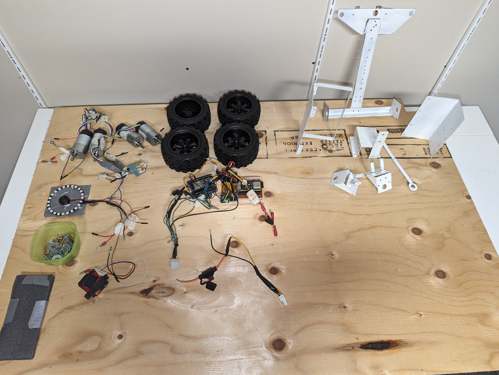

# A remote controlled vehicle with a mechanical arm using ESP32 and a PS3 Dualsense controller
It's heavy, it's noisy, it's klonky and it looks like a rudimentary machine. That's exactly what I wanted to build.
This is work in progress, so no pictures of the final build yet

# Electronics
I chose to use 2 ESP32. It would have been easier to use just one, but I needed the memory of a esp32-s3 and the classic BT from the ESP32. So I'm using both. 
The ESP32 is the DualSense (PS5 controller) receiver. It handles the connection and incoming data from the Dualsense
and sends it on the i2c bus. This device will most probably end up handling other misc stuff too.

The esp32-s3 is main controller.
    - Controls the 4 motors
    - Controls servo for steering
    - Reads pulse count for each motors (RPM reading)
    - Controls the buzzer
    - Controls LED ring
  
# Choice of motors
I'm using 4 12v DC motors with a stall current of 7A with 4 DRV8871 that limits current to 2A for each motor.
The PWM signal to control the motor is shared for all DRV8871 so 4WD is disabled by software. Emiting the PWM on 3 more pins 
and requiring the motors would enable 4WD.

I tried to do the maths for calculating how big of a motor I would need to make something from steel, so targeting 5kgs.
Every number I came with gave me way too big requirements for motor size. This didn't make any sense considering the current offer of motors. So I decided to aim 251RPM and get high torque. 50$ a motor sounded like expensive so I guess it's good.
It turns out the torque is sufficient since the drv8871 doesn't seem to suffer. But 251RPM is faster than what I need. I would half that if I have to buy new motors.

After shopping around, it seems like building something that requires more than 10A of total current draw would be a different game. Different manufacturer and different tutorials. This hinted me that I should stick to this limit.

# PS5 Controller
I found an ESP32 ps5 library at https://github.com/rodneybakiskan/ps5-esp32.git but it was made for Arduino and is not maintained.
So I modified it to make it work outside the Arduino environment with only ESP-IDF. I'm having problems with it though. 
Connecting the controller is a hit or miss, sometimes I have to reboot the board and retry many times. But it works fine when 
using the Arduino version. I suspect it has something to do with multithreading/multicore since there seems to be a race condition when the controller tries to connect to the board and the board tries to connect to the controller at the same time. So I disabled the connection attempt from the board and it now works. I'll have to make a better fix later.

The controller is a bluetooth device so it has a range limit of 10m, but that's not an issue since I only plan on using this in the house.

# Frame
I chose to use steel for the frame. Aluminum would be better, but I don't have the tools to work aluminum. Plus, aluminum is expensive.
I developed an interest in welding lately so I wanted to play around with my tools.

## Motor mounts
The motor mounting brackets were a bit of a challenge for me. I used a piece of paper and poke holes where the screw holes of them motor were. Then I glued the the paper on a sheet of metal and cut/drilled it.

Of course the first piece I built was bad, but the second one only has 1 hole misaligned. Close enough.
So I now use that piece as a template to build more.

## Subframe
The subframe is just a 3cm wide steel bar welded on the rear axle and bolted on the from one. I prefered to put bolts on the front s o it would be easier to put a better steering mechanism in place some time.

The vehicle is separated in 4 sections: The steering, battery mount, main board and mechanical arm.
There is a series of holes on the subframe that allows me to bolt the battery mount and main board at varying distances.

# Steering
To build a steering, I practiced a few prototypes with Legos. Then I ended up building something like this:
It's not perfect, but it works. Using ball joints would be much better.

 

# Battery mount
The battery mount is just an L-shape plate on which the battery is tie-wrapped.
The battery sits on a foam to reduce vibrations.

# Main board
The main board is a piece of plywood on which all PCBs are screwed. It consists of the main ESP32 board, the PS5 controller ESP32 board and 2 small 5v regulators.

# Mechanical Arm
The goal was to be able to lift a 500ml can of beer.

- Base
    - Sits on bearing. Base is a big gear but not 360. Like the chute of a snoblower
    - regular DC motor with gear to spin the base. 
        - No need for high torque. No need for high speed although the gear ratio of the base must be taken in consideration

- Boom and Arm
    - 2 regular motors. Or servos? Servos cant be controlled like a real bakhoe
    - Sitting on the base. Pulling the boom and arm using levers
- Grapple
    - Servo sitting on the arm

I wanted the feel of the arm to be like a backhoe control. My initial implementation was taking a value from the Dualsense constroller sticks. This value is between -128 and 127 and was mapped to an angle on the betwwen 0 and 90 on the servo.
This has the affect of using the controller to bring the arm to a set value instead of simply accellerating the arm, like a hydraulic system would. This is a big difference in feel. Also, when releasing the DualSense stick, the servo would return back to its original position. In a hydraulic system, you simply want the arm to stop moving and stay at its current position.

It took a fair amount of code to replicate this behaviour but I'm overall satisfied. It definitely feels more "mechanic" that fluid like a hydraulic system but I think I like it.

The arm can only be used while in "arm" mode. Arm mode is activated/deactivated with the Dualsense cross button.
While in arm mode, the throttle is disabled and the steering is disable to be able to use the sticks for controlling the arm.
Another reason, is that it would require too much power to run the 4 motors and the servos at the same time.
To reduce power usage event more, only 1 servo per sticks can be used at the same time. The 5v regulator that feeds the servo cannot exceed 3A.

# Metrics
The machine creates a WAP and has the IP address 192.168.4.1. It sends a UDP packet to 192.168.4.2:242 every second. This packet
contains the metrics of the machine as defined in [mainboard/main/common.h](mainboard//main/common.h) in `struct metrics_t`

# Wifi
The vehicle creates a WAP called "ROVER". I've configured my router to auto-connect to that WAP and take the address 192.168.4.2.
The router then forwards UDP 242 to my dev machine so I can receive stats broadcast while developing.

From my dev machine, I can also trigger a OTA firmware upgrade so I don't need to connect the vehicle with a USB cable anymore.

# Results
TODO: top speed, battery life, current draw (if 7.5 fuse does not blow, we're ok)

# Improvements
There are many design flaws with this machine. Mostly because of my limited knowledge about mechanics and electronics, but also because
of a consious choice to sacrifice performance to be able to use limited resources. For example, a few pivot points would gain by being installed on a bearing or ball joint, but this would have become too expensive. I had everything on hand already to build a poorman's version. I like to think of it as working as if in a post-apocalyptic world and scavanging for parts :)

# Pictures

Prototype of robotic arm with legos. It's not what I will end up building.

Wiring reference picture

Project status Jan 17

Guts and wheels mounted

Project status Jan 22

Prototype is working. I'm ready to finish the frame. So it's now time to disassemble everything.

Everything is painted. I just need to let it dry 24h and I will re-assemble everything

